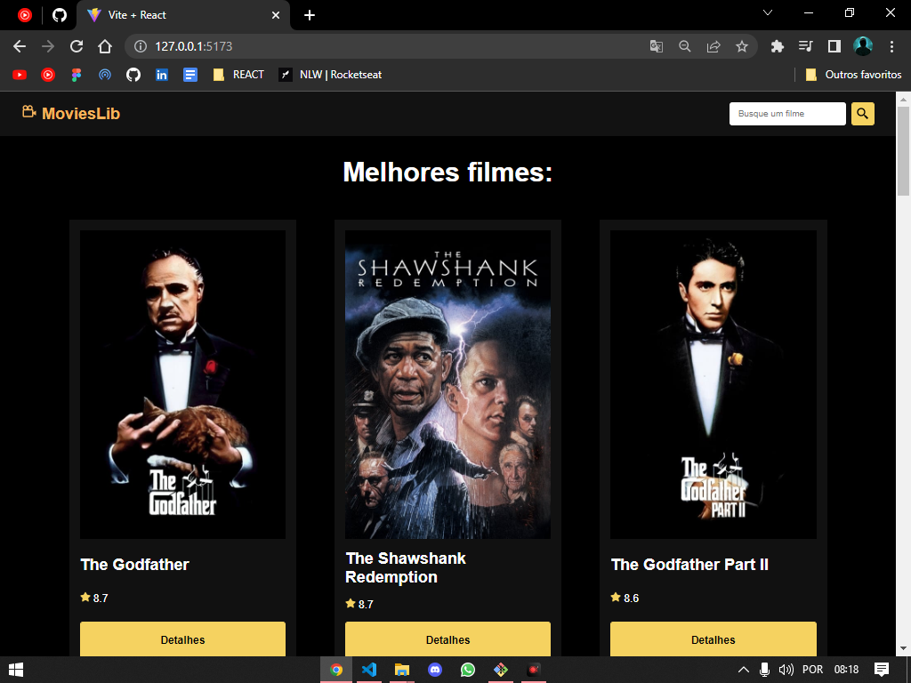
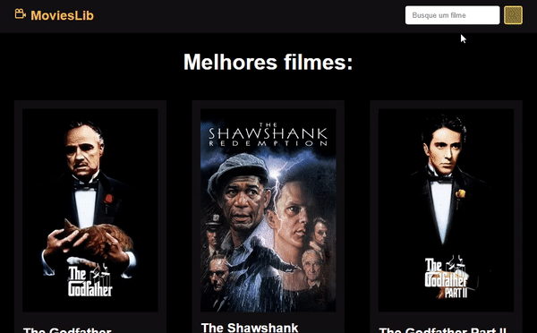

# MOVIES LIB

Projeto feito com ReactJs e ViteJS.

API usada: <a href="https://www.themoviedb.org/" target="_blank">The Movie db</a>

## 🔵Página PRINCIPAL

Temos logo de cara os melhores filmes apresentados

## 🤓DETALHES

Página aberta ao se efetuar o clique nos detalhes de algum filme

 
## Recurso de PESQUISA🔍

